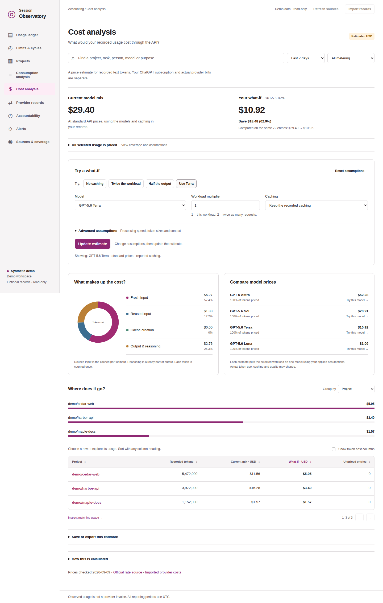

# Session Observatory

**Understand your Codex usage in your browser. Keep the evidence on your computer.**

Session Observatory turns local Codex logs into a searchable usage ledger, interactive charts, historical limit readings, and API cost comparisons. The primary edition is one self-contained HTML file: open it locally, choose your evidence, and explore it offline.

No installation, server, account connection, or API key is needed to use the browser download. The app does not upload your files, send telemetry, or download runtime assets. Evidence stays in memory until you choose to save or export it; a previously saved workspace loads when you reopen the app.

## Start in your browser

1. Download **session-observatory-browser.html** from this repository's Releases page. Use the HTML attachment, not GitHub's automatic source ZIP.
2. Open it in a recent desktop Chrome or Edge browser. The file is about 18 MB; the embedded engine takes a few seconds to start.
3. Choose **Try fictional demo** to explore without reading your logs, or **Choose Codex log folder** to import your own evidence.
4. Open **Consumption analysis** or **Cost analysis**. Re-select a folder whenever you want to import newer records.

Nothing is scanned automatically. You can disconnect from the internet before opening the HTML. The [browser walkthrough](BROWSER.md) covers log locations, saving, backups, migration, and troubleshooting.



## Your evidence, your choice to keep it

| Choice | What it means |
|---|---|
| Explore in memory | No evidence snapshot is saved automatically. Reloading or closing loses unsaved changes. |
| **Save in this browser** | Store a local snapshot. Save again after further changes; there is no autosave. |
| **Download complete backup** | Keep a portable copy of evidence, declarations, audit history, and named saved cost assumptions. |
| **Forget this workspace** | Clear this tab and the saved evidence snapshot. Original logs and downloaded files remain. |

Selected logs are read into memory. The ledger retains accounting metadata, not prompt bodies or tool output. That metadata can still include private project paths, identifiers, and declarations. Saved snapshots and exports are not encrypted by the app, and browser storage is not guaranteed permanent.

Read [Privacy and your data](PRIVACY.md) for the complete storage, network, export, and deletion boundaries. For a public screenshot or bug report, use the fictional demo.

## What you can learn

- **Where usage went.** Explore tokens by project, model, task, person, purpose, source, and time; follow chart selections into the matching records.
- **What the evidence says.** Inspect source references and conflicts, and declare ownership and purpose with a separate audit history.
- **What API pricing would imply.** Compare the current model mix with another model, caching assumption, or workload size; export the calculations.
- **What limits were recorded.** Inspect historical source-reported percentages and reset times alongside usage.
- **What other exports add.** Import provider usage/cost pages and normalized activity records for local review.

Observed usage covers only the evidence you import. API estimates use a dated price snapshot and are hypothetical text-token costs, not your ChatGPT subscription bill. Unknown prices stay unpriced. Historical limits are not live account balances, and local activity checks cannot detect every use of an account on other devices.

This is an independent community project, not an OpenAI product.

## Build the browser file from source

If no HTML release is available yet, extract the source release or use a source checkout. With Node.js 22+ installed, run:

```sh
npm ci --ignore-scripts
npm run build:browser
```

Open `dist/session-observatory-browser.html`. Dependency installation requires network access; the resulting app works offline. The build embeds explicit application and runtime assets, not your local evidence. Source archives do not include the generated HTML.

## Optional automatic collection

For automatic folder rescanning, a separate [Python collector edition](COLLECTOR.md) runs a loopback server and stores metadata in a local database. It has a different persistence model from the browser edition. Use it when you need ongoing collection while its process is running.

## Documentation

| Read this | For |
|---|---|
| [Browser guide](BROWSER.md) | First use, imports, saving, backups, and troubleshooting |
| [Privacy](PRIVACY.md) | What is read, retained, shared, and deleted |
| [User guide](GUIDE.md) | Ledger features, attribution, accounting rules, and import formats |
| [Analytics](ANALYTICS.md) / [Cost analysis](COSTS.md) | Chart definitions and pricing assumptions |
| [Windows and source folders](WINDOWS-SOURCES.md) | Native, WSL, copied, and custom-home logs |
| [Collector](COLLECTOR.md) | Optional server setup and database handling |
| [Contributing](CONTRIBUTING.md) / [Releasing](RELEASING.md) | Development checks and public artifacts |
| [Security policy](SECURITY.md) | Reporting a vulnerability and the protection boundary |

[Background research](docs/RESEARCH.md) is a dated design proposal; it includes integrations that are not implemented.

## License

[Apache License 2.0](LICENSE), with [NOTICE](NOTICE). The browser runtime retains its upstream licenses, including Pyodide MPL-2.0; see [third-party notices](browser/THIRD-PARTY.txt).
